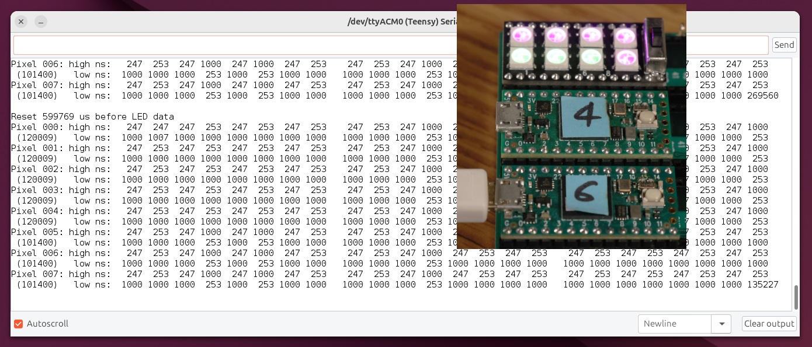
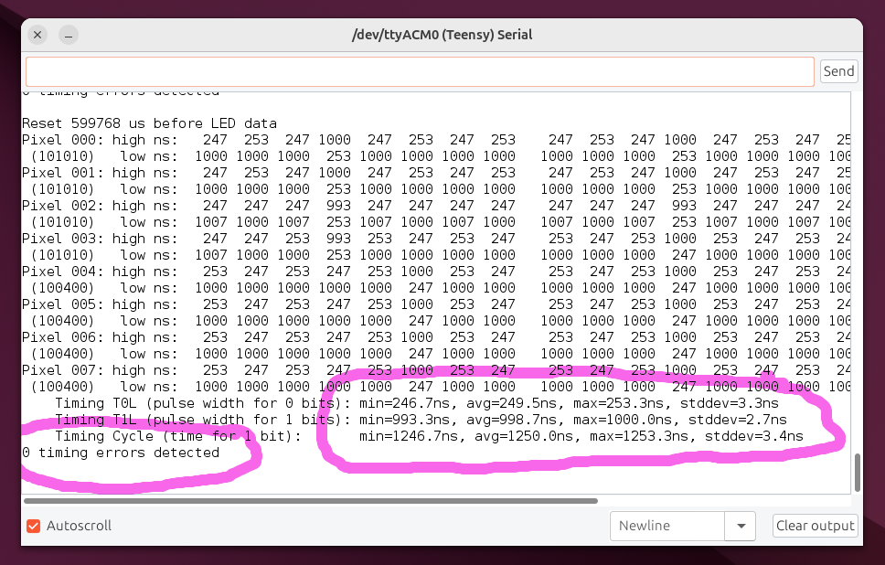

# Capture and Analyze Timing of WS2812 LED Data

WS2812Capture is a Teensy 4.x library which can capture and analyze WS2812 LED data.
Its primary purpose is to verify the correctness of timing used by other libraries
which transmit data to WS2812 addressable LEDs.

Teensy 4.x FlexPWM timers with dual input capture are used to sample the incoming data
at 150 MHz, giving 6.7ns timing accuracy.  DMA is used to efficiently move measured timing
to RAM, giving a CPU-free solution to capturing WS2812 waveform timing.

Teensy's 600 MHz CPU is used to detect the 50-300us reset time between LED data frames,
to check timing for a variety of errors, to compute simple timing statistics, and of
course to decode raw timing data into pixels.

## Hardware

A resistor divider should be used to reduce the 5 volt signal level used by WS2812
to the 3.3V level needed.  Teensy 4.0 pins are not 5V tolerant, so direct connection
of a 5V signal could risk hardware damage.

Pins 2, 4, 5, 6, 8, 22, 23, 29 on Teensy 4.0 or Teensy 4.1 may be used to capture WS2812 data.

Pins 36, 49, 53, 54 are also supported on Teensy 4.1.

## Basic Functions

* `WS2812Capture myleds(Pin, PixelFormat)`

    Create a WS2812Capture instance which captures using a specific pin.  PixelFormat may be WS2812_RGB, WS2812_GRB, WS2812_RGBW, WS2812_GRBW, etc.  In theory, multiple instances may be created to capture parallel WS2812 data, but in practice how many parallel streams Teensy 4.0 can handle remains an unanswered question...
  
* `myleds.begin(buffer, sizeof(buffer))`

    Begin capturing, using buffer memory your program supplies.  WS2812Capture needs 99 bytes for each regular RGB LED, or 132 bytes for each RGBW LED.  Each incoming byte of LED data is captured as 8 low time measurements, 8 high time measurements (16 bits each), and 1 actual decoded byte.  If cached memory is used, aligning to cache row size (32 bytes on Teensy 4.x) will allow better performance.

* `myleds.available()`

    Check for new LED data arrival.  When a complete LED data frame has arrived, the non-zero number of bits is returned.  Otherwise 0 is returned when no data has arrived, or while a partial LED data frame is still incoming.  This function should be called as rapidly as possible, because it implements the checking for the reset timing between LED data frames.

* `myleds.numPixels()`

    Return the number of pixels actually received.

* `myleds.getPixel(index)`

    Return the RGB or RGBW data for a single pixel.  Data is always given in RGB or WRGB (white in upper 24 bits) format.

## Timing Settings and Error Detection

* `myleds.setResetThreshold(microseconds)` - default is 12us

    Configure the minimum reset time available() uses to detect the end of LED data.

* `myleds.getTimingErrorCount()`

    Return the total number of timing errors detected within the current LED data.

    The following functions allow adjusting the timing considered correct versus erroneous.

* `myleds.setT0H_min(nanoseconds)` - default is 90ns

    Configure the minimum pulse width for logic 0 pulse.  Shorter will counted as errors.

* `myleds.setT0H_max(nanoseconds)` - default is 340ns

    Configure the maximum pulse width for logic 0 pulse.  Longer will counted as errors.

* `myleds.setTH_threshold(nanoseconds)` - default is 450ns

    Configure the threshold for decoding pulse width as logic low versus logic high.  This setting must be between T0H_max and T1H_min for proper error detection.

* `myleds.setT1H_min(nanoseconds)` - default is 560ns

    Configure the minimum pulse width for logic 1 pulse.  Shorter will counted as errors.

* `myleds.setT1H_max(nanoseconds)` - default is 1100ns

    Configure the maximum pulse width for logic 1 pulse.  Longer will counted as errors.

* `myleds.setTL_min(nanoseconds)` - default is 150ns

    Configure the minimum low time after each pulse.  Shorter will counted as errors.

* `myleds.setCycle_min(nanoseconds)` - default is 1100ns

    Configure the minimum total cycle time per bit.  Shorter will counted as errors.

* `myleds.setCycle_max(nanoseconds)` - default is 2400ns

    Configure the maximum total cycle time per bit.  Longer will counted as errors.

## Simple Timing Statistics

* `myleds.getT0H_minimum()`
* `myleds.getT0H_average()`
* `myleds.getT0H_maximum()`
* `myleds.getT0H_stddev()`

    Return simple stats for the pulse width of all 0 data bits.

    Because capture uses 150 MHz sampling, or 6.7ns resolution, these stats can be expected to self-vary by 6.7ns and stddev will typically be up to 3.4ns even when the original waveform has no timing variation.

* `myleds.getT1H_minimum()`
* `myleds.getT1H_average()`
* `myleds.getT1H_maximum()`
* `myleds.getT1H_stddev()`

    Return simple stats for the pulse width of all 1 data bits.

* `myleds.getCycle_minimum()`
* `myleds.getCycle_average()`
* `myleds.getCycle_maximum()`
* `myleds.getCycle_stddev()`

    Return simple stats for the total cycle time of all but the last data bit, because the last bit low time blends with the reset low time after the LED data frame.

## Detailed Timing Functions

* `myleds.numBits()`

    Return the number of data bits actually received.  This function is essentially the same as numPixels() multiplied by 24 or 32, but it can indicate whether extra unnecessary bits were transmitted after those needed by the last LED.

* `myleds.bitHighNanoseconds(index)`

    Return the logic high time for a single bit, in nanoseconds.  Bits are indexed in the order actually received, not rearranged to PixelFormat as with getPixel(index).

* `myleds.bitLowNanoseconds(index)`

    Return the logic low time for a single bit, in nanoseconds.  The last bit of a WS2812 frame has undefined logic low time, because the low time for that last bit blends together with the logic low reset time between frames.

* `myleds.getResetMicroseconds()`

    Return the logic low reset time, in microseconds, which preceded the current LED data.

